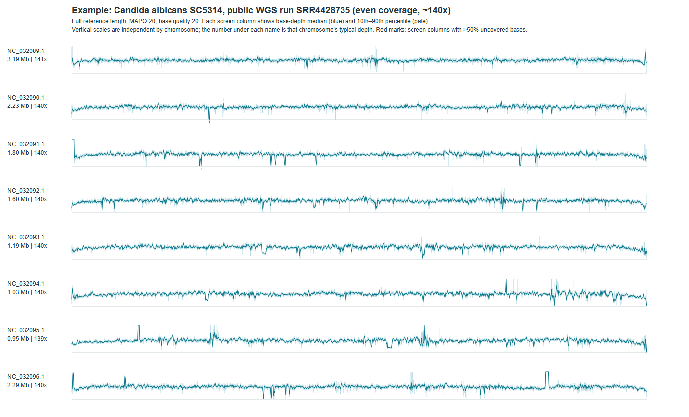

# Nuclear Coverage Map

`nuclear_coverage_map.py` draws a whole-genome read-coverage map from a BAM file as one SVG: every chromosome is drawn
end to end as its own panel. It is a fast visual check of library and mapping quality.

**What it shows:**
- **Even coverage:** a flat blue line near the chromosome's typical depth.
- **Problems:** coverage sags, uneven libraries, aneuploid or missing chromosomes, mapping artifacts.

## Example



This is *Candida albicans* SC5314, public WGS run SRR4428735, mapped to the SC5314 reference. It shows what good
data looks like:
- **Flat lines:** every chromosome sits at ~140×.
- **Even coverage:** 98.8% of screen columns are within 2-fold of the typical depth.
- **No gaps:** no column is mostly uncovered.

The few short dips and spikes are repeated sequences such as rDNA, telomeric repeats and transposons, which every
sample shows. The full-resolution output is [`example_map.svg`](example_map.svg).

A problem library looks different: lines that sag in the middle of large chromosomes, chromosomes at very different
depths, or runs of red ticks.

## What the map shows

| Element | Meaning |
|---|---|
| Blue line | Median read depth in each screen column (~1,050 columns per chromosome) |
| Pale band | 10th–90th percentile of depth in that column |
| Red tick | Column where more than half the bases have no reads |
| Number under the chromosome name | Its typical (median) depth; each panel has its own y scale |

Only reads with mapping quality ≥ 20 and bases with quality ≥ 20 are counted. Every reference sequence longer than
100 kb is drawn.

## Requirements

- Python 3 (standard library only)
- `samtools` on your `PATH`
- A coordinate-sorted, indexed BAM (`samtools index sample.bam`)

## Usage

```bash
python3 nuclear_coverage_map.py sample.bam sample.svg sample.tsv "Sample | species | strain" [contig_to_skip]
```

- `contig_to_skip` (optional): a sequence to leave out. Use it, for example, for the mitochondrial contig when reads
  were mapped to a genome that includes the mtDNA, so the very high mito depth does not dominate. Use `NONE` or
  leave it out to draw everything.
- `sample.tsv`: the numbers behind every column (`chrom, start, end, p10, median, p90, zero_fraction`), useful for
  scoring maps automatically. For example, count the fraction of columns within 0.5–2× of the median depth as an
  evenness score.
- Standard output: one summary row per chromosome (length, median depth, y-scale maximum, number of mostly
  uncovered columns).

## Running many samples on a SLURM cluster

```bash
#!/bin/bash
#SBATCH --job-name=coverage_maps
#SBATCH --array=1-100%20
#SBATCH --mem=8G
#SBATCH --time=04:00:00
# manifest.tsv (tab-separated, no header): sample  bam_path  title  contig_to_skip
set -euo pipefail
module load samtools
IFS=$'\t' read -r SAMPLE BAM TITLE SKIP < <(sed -n "${SLURM_ARRAY_TASK_ID}p" manifest.tsv)
mkdir -p svg tsv
python3 nuclear_coverage_map.py "$BAM" "svg/${SAMPLE}.svg" "tsv/${SAMPLE}.tsv" "$TITLE" "$SKIP" > "tsv/${SAMPLE}.summary.tsv"
```

## Settings you can change in the script

| Value | Where | Meaning |
|---|---|---|
| `100000` | sequence selection | Minimum sequence length drawn (bp) |
| `1050` | `width_bp = math.ceil(length / 1050)` | Number of screen columns per chromosome |
| `-Q 20 -q 20` | `samtools depth` call | Minimum mapping quality and base quality |

For highly fragmented assemblies, such as references with thousands of short contigs, chromosome panels are not
useful. Summarise depth in fixed windows instead.
